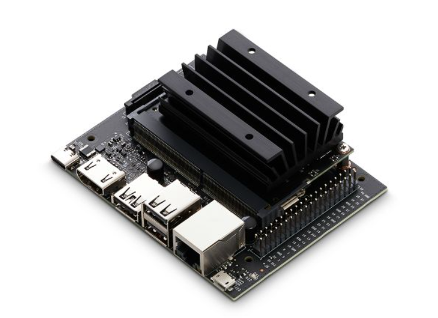
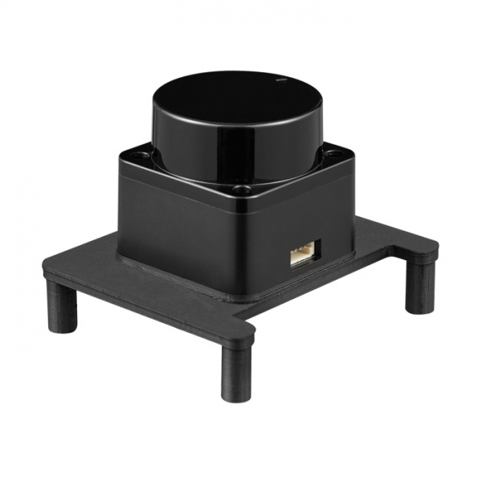
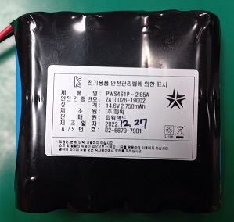

==============
중요 부품
==============

제타봇의 주요 부품들입니다.

.. list-table:: 
   :header-rows: 1

   * - Product Picture
     - Product Description
   * - |part_1| 
     - | Jetson Nano
       | GPU : 128-코어 맥스웰
       | CPU : 쿼드코어 ARM A57
       | 메모리 : 4GB 64bit LPDDR 25.6GB/s
       | 스토리지 : Micro SD
   * - |part_2| 
     - | Raspberry Pi 4B 4GB
       | GPU : Broadcom BCM2711 SoC
       | CPU : ARM-A57 1.5Ghz
       | 메모리 : 4GB 64bit LPDDR-2400
       | 스토리지 : Micro-SD
   * - |part_3| 
     - | OKDO LIDAR HAT
       | UART interface
       | 4500points/s sample rate
       | 12 meter range
   * - |part_4| 
     - | 리튬이온 배터리팩
       | 충전 : 16.8V / 3.5A
       | 출력: 14.6V / 2750mAh

.. |part_2| image:: ../images/crit_2.webp 

