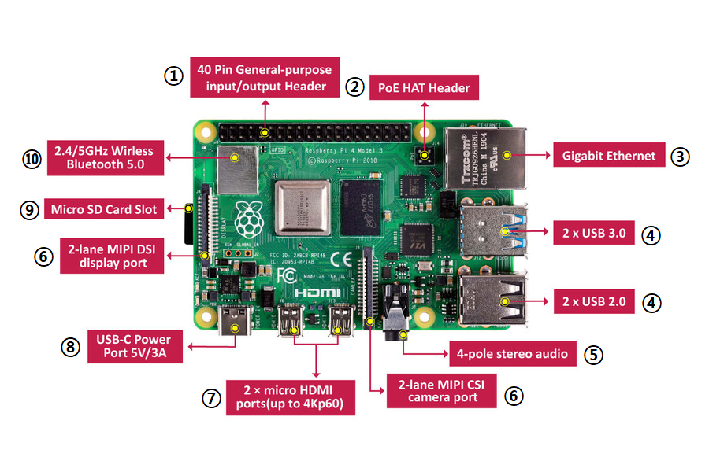

====================
SBC(Raspberry PI 4B)
====================

제타봇의 핵심인 라즈베리 파이에 대한 설명입니다.

.. list-table:: 
   :header-rows: 1
   
   * - 번호
     - 인터페이스
   * - 1
     - GPIO 40 핀
   * - 2 
     - HAT 헤더
   * - 3
     - 이더넷 포트
   * - 4
     - USB 포트
   * - 5
     - 오디오 아웃풋 포트
   * - 6
     - 카메라 커넥터
   * - 7
     - 마이크로  HDMI 포트
   * - 8
     - C-type 전원 케이블
   * - 9
     - 마이크로 SD 슬롯
   * - 10
     - 와이파이 / 블루투스 모듈