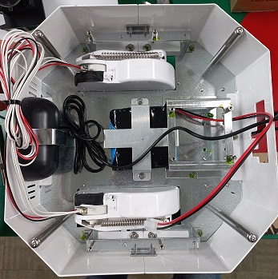
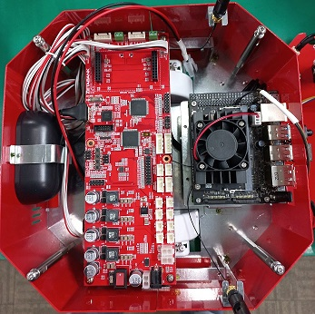
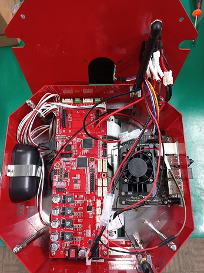

==================
※ Jetson Nano ver.
==================

.. list-table:: 
   :header-rows: 1

   * - 그림
     - 설명
   * - |part_1|
     - 1. 모터, 배터리, 스피커를 조립합니다.
   * - |part_2|
     - 2. 파워보드, 젯슨 나노를 조립합니다.
   * - |part_3|
     - 3. 라이다 및 기타 배선류를 조립합니다.

 

